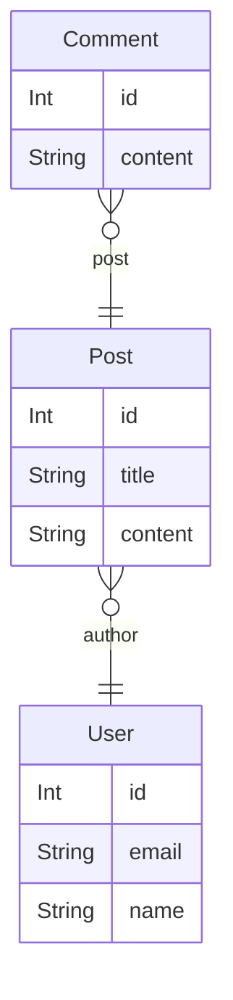

# Compare postgreSQL @string and @varchar(n) performance

This is a simple test to compare the performance of @string and @varchar(n) in postgreSQL.

### Database Setup

```
npm run db:migrate:dev
npm run db:seed 
```

# Test 1 - Strings

### Schema



### 1 - Aggregate query

```SQL
select count(*) from "Post" inner join "User" on "Post"."authorId" = "User".id
```

duration: 0.000s