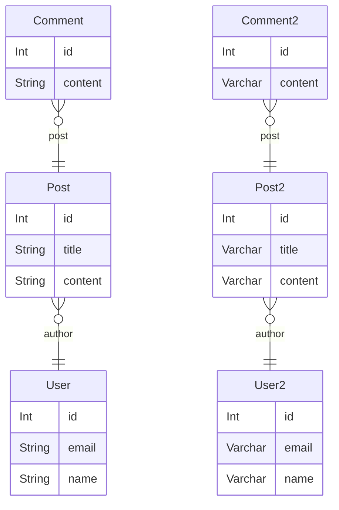

# Compare postgreSQL @string and @varchar(n) performance

This is a simple test to compare the performance of @string and @varchar(n) in postgreSQL.

### Database Setup

```
npm run db:migrate:dev
npm run db:seed 
```

## String schema - Varchar schema



### 1 - Aggregate query

User's posts total count query
```sql
select count(*) from "Post" inner join "User" on "Post"."authorId" = "User".id
```
String Time: 2219 ms
Varchar(n) Time: 1475 ms
Percentage Gain: 150,4%


---
User's posts order by title asc LIMIT 50
```sql
select * from "Post" order by "title" asc LIMIT 50
```
String Time: 1148 ms
Varchar(n) Time: 1092 ms
Percentage Gain: 105,1%


---
User's posts where title = 'ABC'
```sql
select * from "Post" where "title" = 'A ab beatae.'
```
String Time: 676 ms
Varchar(n) Time: 564 ms
Percentage Gain: 119,9%


---
User's posts where title != 'ABC'
```sql
select * from "Post" where "title" != 'A ab beatae.' LIMIT 50
```
String Time: 11 ms
Varchar(n) Time: 10 ms
Percentage Gain: 110,0%


---
User's posts where title LIKE 'ABC%'
```sql
select * from "Post" where "title" LIKE 'A ab beatae%'
```
String Time: 730 ms
Varchar(n) Time: 623 ms
Percentage Gain: 117,2%


---
User's posts where title IN array
```sql
select * from "Post" where "title" IN ('A ab beatae.', 'A ab beatae delectus.', 'Culpa debitis ut.', 'Molestias ipsum vero.')
```
String Time: 921 ms
Varchar(n) Time: 900 ms
Percentage Gain: 102,3%


---
User's posts group by title having
```sql
select "title", count(*) from "Post" group by "title" having count(*) > 2
```
String Time: 9326 ms
Varchar(n) Time: 9022 ms
Percentage Gain: 103,4%

---

Average percentage Gain: 115,4%